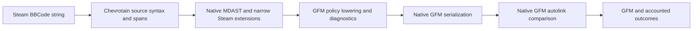

# Architecture

The forward boundary separates source syntax, source semantics and target policy.
This keeps literal source from becoming Markdown before the serializer owns it.

`src/steam/` owns source grammar, immutable parse results and generated registry
projections. `spec/` is the provenance-backed source of truth; generators validate
its JSON schemas before projecting data. The grammar library owns tokenization
and parsing machinery; package code supplies the qualified Steam grammar.

`src/mdast/` interprets syntax into standard mdast/unist contracts and narrowly
typed Steam extensions. It accounts for constructs and preserves complete source
where parameter or structural meaning is unqualified. Ordinary flow whitespace
is interpreted here, while protected text and original source positions survive.

`src/gfm/` lowers source-only presentation with explicit fidelity. Native unified
ecosystem libraries own Markdown syntax serialization and target parsing. The
additional autolink check models a separate renderer concern; no post-serialization
text cleanup or invisible-character workaround is installed.

The reverse path starts with the native GFM parser, checks its structure against
resource bounds and renders only the qualified Steam subset. Unsupported source
spans pass through a literal encoder. It has independent node coverage and does
not borrow the forward registry's completion claim.

`src/security/` owns small resource and URL policies. `src/cli.js` alone owns file
and stream I/O and is an installed executable, not a package-root library export.
`test/` contains authored expectations, properties, native consumer checks and
parser qualification. `comparison/` holds isolated alternative installations and
raw comparison evidence, excluded from the published package.

Public types are generated from checked JavaScript, using native mdast/unist
types and explicit child-slot unions. There is no global MDAST augmentation,
duplicate handwritten declaration API or runtime TypeScript implementation.
